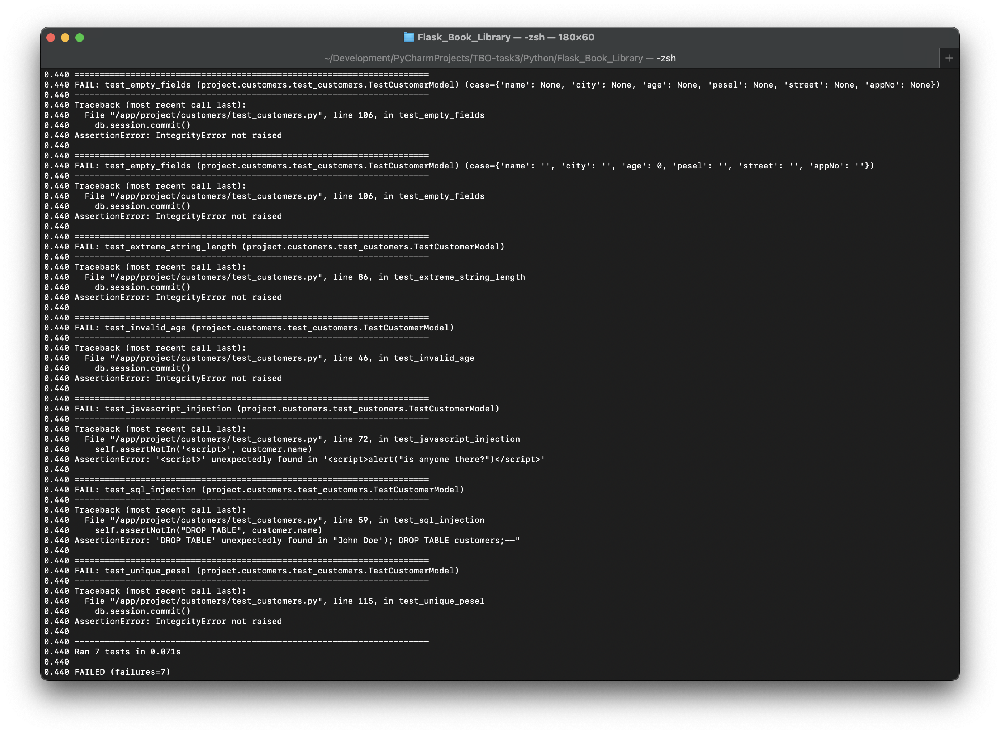
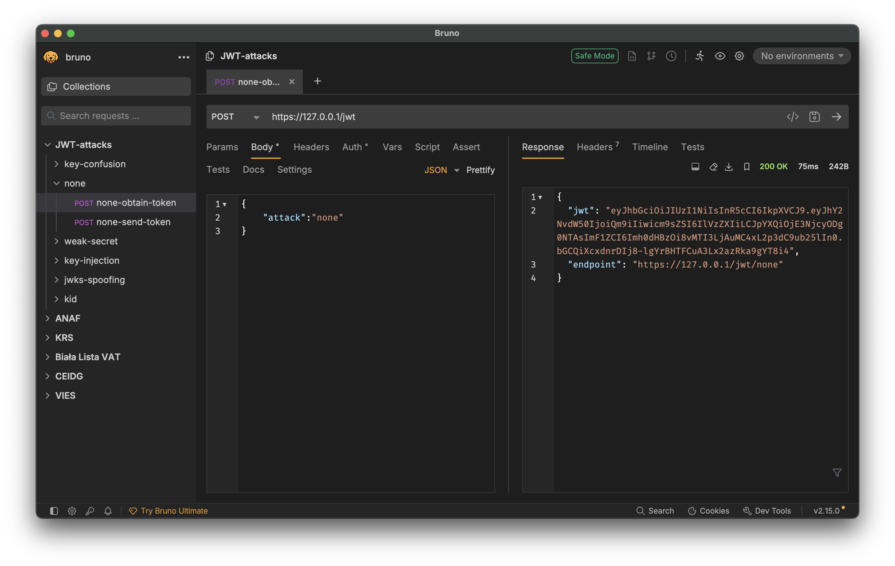
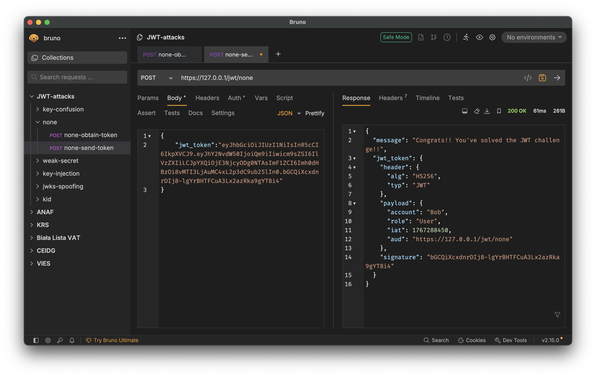
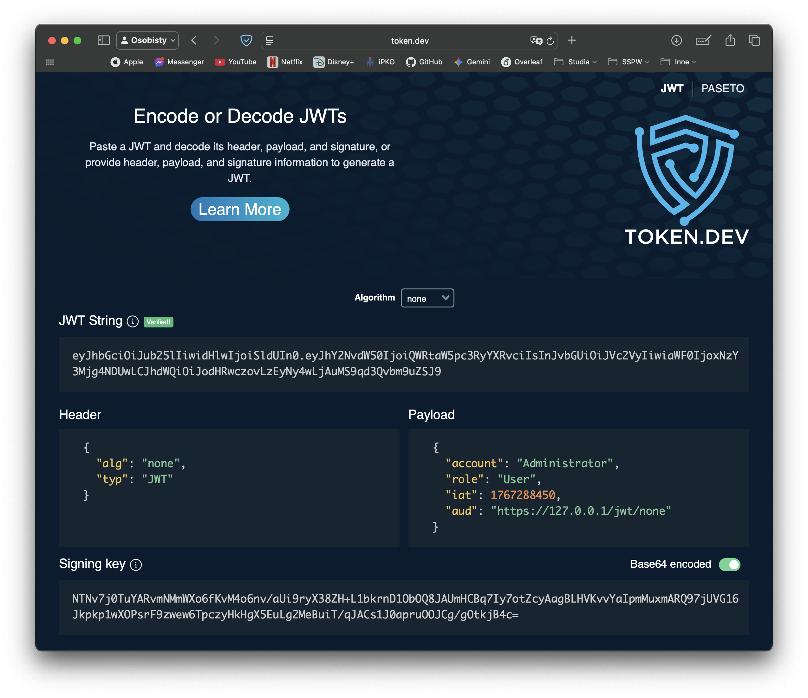
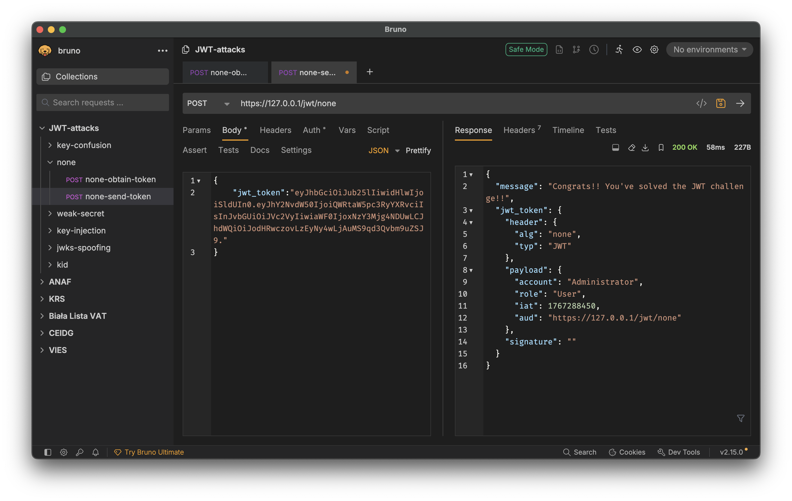
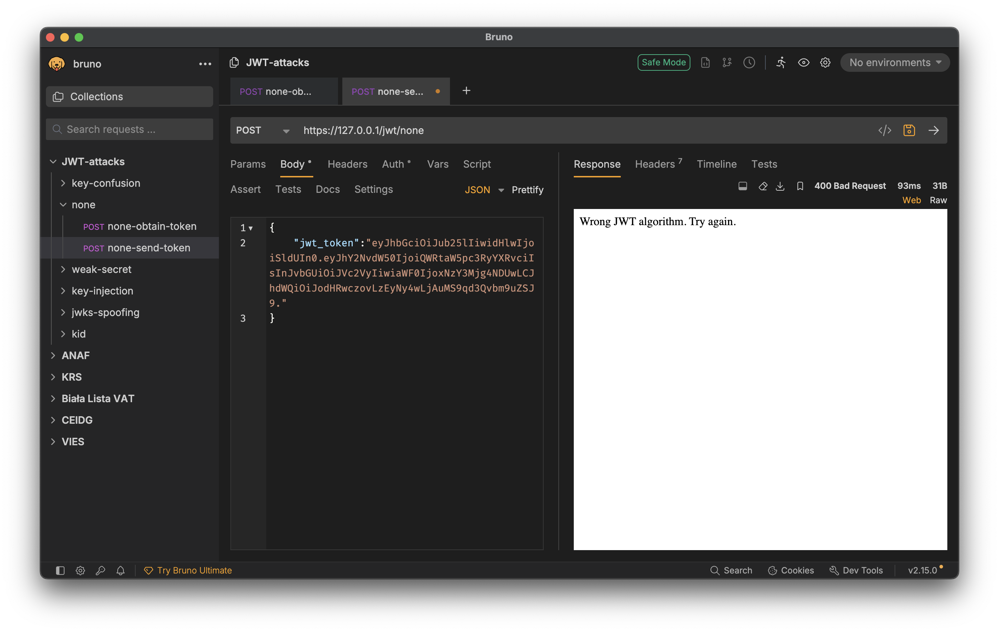

# Security By Design - Laboratoria 3

## Zadanie 1: Implementacja rozszerzonego zestawu testów jednostkowych

Dla modelu `customers` przygotowano kompleksowy zestaw testów, obejmujący:
* Weryfikację poprawnych danych (happy path).
* Obsługę danych nieprawidłowych (walidacja).
* Testy bezpieczeństwa (podatność na SQL Injection oraz XSS/JavaScript injection).
* Przypadki skrajne (testy ekstremalne).

**Status:** Zgodnie z założeniami, przy obecnym stanie implementacji, testy kończą się wynikiem negatywnym.

## Zadanie 2: JWT — wykorzystanie podatności oraz realizacja poprawki

W pierwszej kolejności pozyskałem JWT dla użytkownika Bob:

Następnie przy pomocy narzędzia [token.dev](https://token.dev) zmodyfikowałem token, zmieniając nazwę użytkownika z `Bob` na `Administrator`:

Token został przyjęty bez problemu przez serwer, umożliwiając dostęp do zasobów z uprawnieniami administratora:

Zgodnie z wymaganiami, wprowadziłem poprawkę do mechanizmu weryfikacji tokenów JWT.
Po jej wdrożeniu, próba użycia zmodyfikowanego tokena kończy się odrzuceniem go przez serwer:

